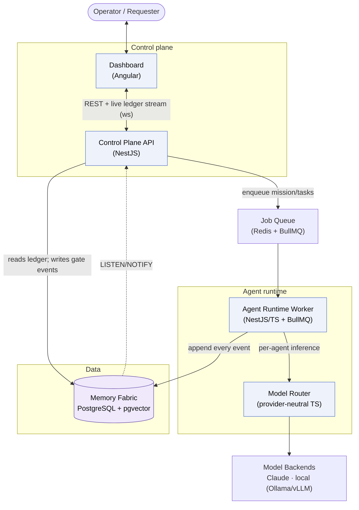
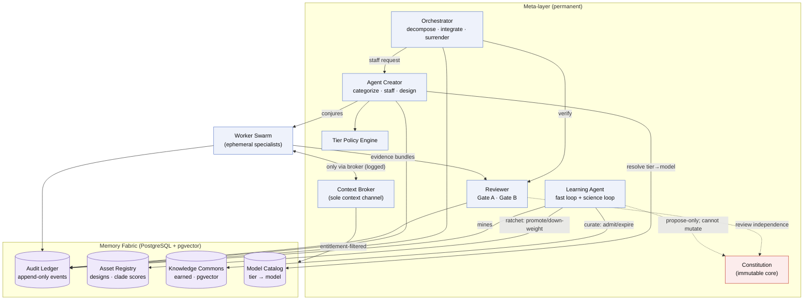

# Artifex — Architecture

> **This describes the *intended* architecture.** Implementation has started and is early — the workspace, the shared schemas, and the Memory Fabric data layer exist; the meta-agents and the mission loop do not yet. This document remains the target that code is built toward, and the reference for reviewing whether a change fits the design.
>
> **Sources of truth:** the functional design in [`solution/`](solution/) (rendered dossier), the decisions in [`docs/decisions/`](docs/decisions/) ([ADR-0001](docs/decisions/ADR-0001-implementation-stack.md), [ADR-0002](docs/decisions/ADR-0002-model-tiering-and-inference.md)), and the Tasktracker project **Artifex** (system of record for components, relationships, and requirements). If this file and an ADR disagree, the ADR wins and this file should be fixed.

## Mental model: two planes + one fabric

Artifex splits into two runtime planes over a shared memory fabric:

- **Control plane** — short-lived request/response + websockets. Mission intake, human gates, auth, and streaming the audit ledger to the dashboard. Never runs a mission.
- **Agent runtime** — a long-running worker where missions actually execute: decomposition, staffing, verification, fold-up. Massively fan-out (thousands of tasks per mission).
- **Memory Fabric** — one PostgreSQL database that *is* the system's memory: an append-only audit ledger (the single substrate everything renders from), an asset registry, and a knowledge commons.

The single most important structural rule: **the agent runtime is a separate process from the API.** A mission's long-running, thousand-task tree cannot live inside an HTTP request.

## System / deployment view

## Meta-layer & memory fabric view

Everything below lives *inside* the Agent Runtime Worker, except the fabric stores (inside the Memory Fabric). The four **meta-agents** are the only permanent employees; the **Worker Swarm** is conjured per mission and discarded.

## Component reference

| Component | Layer | Technology | Responsibility |
|---|---|---|---|
| **Dashboard** | presentation | Angular | Mission-control cockpit; renders purely from the audit ledger (a view, never a second truth); time-travel replay; five lenses; attention queue. |
| **Control Plane API** | business | NestJS | Mission intake, human gates (written back as ledger events), auth, and websocket streaming of the ledger via `LISTEN/NOTIFY`. Enqueues missions. |
| **Agent Runtime Worker** | business | NestJS/TS + BullMQ | Hosts the meta-layer + swarm; executes missions end to end; appends every action to the ledger. |
| **Model Router** | business | Provider-neutral TS (Vercel AI SDK / thin custom) | Dispatches each agent's `{provider, model, params}` to Claude or a local OpenAI-compatible endpoint. The Claude Agent SDK is one backend behind it, not the spine. |
| **Job Queue** | infrastructure | Redis + BullMQ | Durable high-fan-out work queue between API and worker; prod autoscales on queue depth. |
| **Model Backends** | external | Claude API · Ollama (dev) · vLLM (prod) | The heterogeneous model fleet. |
| **Orchestrator** *(meta-agent)* | business | TS | Recursive decomposition; contract authoring; decompose-vs-delegate gate; mission ledger; fold-up; surrender. |
| **Agent Creator** *(meta-agent)* | business | TS | Task categorization; reuse-first staffing/bidding; designs new specialists; emits capability manifests (incl. model tier). |
| **Tier Policy Engine** | business | TS (in Agent Creator) | Computes model tier per staffing decision (blast radius, fan-in, reversibility, task class, budget, clade score). |
| **Reviewer** *(meta-agent)* | business | TS | Gate A (atomicity) + Gate B (completion); depth by blast radius; structured immutable verdicts; self-calibration. |
| **Learning Agent** *(meta-agent)* | business | TS now (Python seam later) | Fast loop (bounded hot-fixes) + science loop (mine→hypothesize→experiment→ratchet); curates registry & commons; propose-only amendments. |
| **Constitution** | business | TS (immutable) | Metric definitions, review independence, ledger integrity, budget enforcement, amendment protocol. The learner may not rewrite it. |
| **Context Broker** | business | TS | The sole context channel — no peer-to-peer chatter; entitlement-filtered; every exchange logged. |
| **Worker Swarm** | business | TS (ephemeral) | The disposable, contract-scoped specialists conjured per mission. Bulk run at Tier-1 (local). |
| **Memory Fabric** | data | PostgreSQL + pgvector | The one datastore; contains the three stores + the model catalog. |
| **Audit Ledger** | data | PostgreSQL (append-only) | Every event, typed & structured; `LISTEN/NOTIFY` live stream; time-travel replay; the replay-benchmark substrate. |
| **Asset Registry** | data | PostgreSQL (JSONB) | Versioned agent designs/playbooks with clade scores and delta edits; the earned-permanence ratchet. |
| **Knowledge Commons** | data | PostgreSQL + pgvector | Earned, provenanced, mortal knowledge; admission control, re-derivation, expiry; semantic retrieval. |
| **Model Catalog** | data | PostgreSQL (versioned) | Maps logical tier → concrete model; swappable data, admission-gated on real schemas. |

## Model tiering (ADR-0002)

Each agent's model is **computed**, not fixed per agent — a 4-tier ladder keyed to blast radius / cost-of-error. A tier-bump is a rung in the failure-escalation ladder; budget-vs-blast is governed by the per-mission autonomy dial.

| Tier | Model | Used for |
|---|---|---|
| **0** | none (no LLM) | schema / mechanical checks, mechanical Gate B pre-checks |
| **1** | local small (Qwen3.5 / Gemma 4 class) | the bulk of atomic worker tasks — caught by voting/verification |
| **2** | local mid (~32B quantized) | Agent Creator authoring, Gate A, mid-blast semantic review, fold-up |
| **3** | frontier (Claude) | root decomposition, high-blast semantic review, Learning reasoning, surrender |

## Invariants a change must not break

These come from the functional design and the constitution — a PR that violates one is wrong regardless of how clean it looks:

1. **One substrate.** The dashboard renders ledger events and persists nothing of its own. Every human action is written back as a first-class ledger event.
2. **No work without a contract.** Nothing executes without acceptance criteria, boundaries, stopping conditions, and a budget — written before the work, by the level above. The mission is task zero.
3. **Verify both ends.** Atomicity is checked *before* execution (Gate A); completion is checked against the contract *after* (Gate B).
4. **The learner does not own the yardstick.** The Learning Agent may rewrite prompts, playbooks, taxonomies — but never the constitutional core (metrics, review independence, ledger integrity, budget). Amendments are propose-only.
5. **Permanence is earned.** Agent designs and knowledge are ephemeral by default; only measured, replicated, transfer-tested wins are promoted (by clade, not one audition), and losers are down-weighted, never hard-deleted.
6. **No peer chatter.** Agents exchange context only through the Context Broker, and every exchange is logged.
7. **Effort is a currency.** Missions and tasks carry budget floors and ceilings; the fitness function is value-per-effort.

## The four agentic patterns ([ADR-0006](docs/decisions/ADR-0006-agentic-patterns.md))

Artifex is a graph of self-improving agents, and four patterns are treated as load-bearing. Two of them the design already carries; two are acknowledged gaps with requirements against them. They are named here so changes can be tested against them rather than drifting.

| Pattern | Status | Where it lives |
|---|---|---|
| **Planning** — decompose before executing | **Core, and exceeded** | Orchestrator recursive decomposition; invariant #2; the plan is a typed artifact (`TaskContract`). Artifex goes further than "plan first": **Gate A verifies the plan itself** before any execution, and spec faults jump straight to re-decomposition rather than retrying |
| **Multi-agent collaboration** — run a team, not one agent | **Core** | Writer = Worker Swarm · critic = **Reviewer** (a separate meta-agent, not a worker mode) · tester = Tier-0 mechanical Gate B pre-checks + the non-empty `validationHarness`. Orchestrator plans, Agent Creator staffs, Learning Agent improves |
| **Reflection** — critique your own output before submitting | **R12 — contract surface shipped (P2.5); runtime at P8.6** | `ReflectionRecord` and `WorkerContractView` exist. The first correction opportunity is otherwise a Gate B rejection, expensive twice (review often runs a tier *above* the worker, then costs an escalation rung) — a same-tier self-pass is better value-per-effort under invariant #7 |
| **Tool use** — act, don't only think | **R13 — contract surface shipped (P2.5); runtime at P8.5** | `ToolEntitlement`, `ActionRecord` and the `action` ledger family exist; the **Action Broker** that enforces them is P8.5. Context and action stay separate channels: `entitlements` grant knowledge, `toolEntitlements` grant capability |

Two constraints matter more than the patterns themselves, because they are where a well-meaning implementation would break the constitution:

- **Self-review is never self-verification.** Reflection improves a deliverable; it emits no verdict and no task skips Gate B (invariants #3, #4). It critiques against `acceptanceCriteria` and **never** against the `verificationPlan`. Both halves are now *schema guarantees* rather than conventions: `WorkerContractView` fails validation if it still carries a verification plan, and `ReflectionRecord` declares no `gate`/`outcome`/`verdictId` and cannot acquire them.
- **Tool use is brokered, never direct.** An unmediated tool call is an unlogged side effect, which breaks invariant #1 — so `ActionRecord.viaBrokerGrantId` is non-nullable: there is no unbrokered action. Every invocation is entitlement-scoped by the contract and lands in the `action` ledger family. This gives `blastRadius` a second job: it already drives verification depth and model tier, and must also bound *which tools are reachable*, with the autonomy dial gating the ones that need a human first ([ADR-0007](docs/decisions/ADR-0007-r12-r13-sequencing-and-contract-surface.md) carries both tables).

## A mission, end to end

1. **Intake** (Control Plane API) — contract-first dialogue produces *task zero*: success criteria, boundaries, autonomy dial, budget. Enqueued.
2. **Decompose** (Orchestrator) — recursive split into atomic contracted tasks; **Gate A** audits the decomposition before any execution.
3. **Staff** (Agent Creator + Tier Policy Engine) — categorize, reuse-first from the Asset Registry, design new specialists on no-bid; each gets a capability manifest with a computed model tier resolved via the Model Catalog.
4. **Execute** (Worker Swarm via Model Router) — specialists run their contracts; context only through the Broker; results are evidence bundles.
5. **Verify** (Reviewer) — **Gate B** checks completion against the contract; failures enter the escalation ladder (retry higher tier → different agent → redesign → re-decompose → human/surrender).
6. **Fold up** (Orchestrator) — each parent reconciles its children into one outcome; the decomposition tree in reverse.
7. **Deliver or surrender** — a verified result, or a first-class surrender dossier (partial results, blockers, what-it-would-take).
8. **Learn** (Learning Agent, between missions) — mine the ledger, run experiments on replay benchmarks, ratchet proven improvements into the registry/commons; petition for constitutional amendments if warranted.

## Where things live in the repo (planned)

One all-TypeScript npm workspace under `packages/`:

| Package | Holds |
|---|---|
| `shared-types` | The TypeBox contract + ledger-event schemas — the foundation everything else depends on. Dependency-graph leaf; no I/O. |
| `memory-fabric` | Migrations + repositories for the Memory Fabric stores (audit ledger, model catalog). Shared by `api` and `worker` — see [ADR-0005](docs/decisions/ADR-0005-memory-fabric-package.md). |
| `model-router` | Provider-neutral dispatch; resolves a logical tier to a concrete model. |
| `api` | The NestJS control plane. |
| `worker` | The agent runtime — meta-layer + swarm. |
| `dashboard` | The Angular cockpit. |

Dependency direction runs one way: `api` and `worker` both depend on `memory-fabric` and `shared-types`; **`api` never depends on `worker`** — the control plane and the agent runtime are separate processes.

Contributions should trace to a requirement/ADR and preserve the invariants above.
